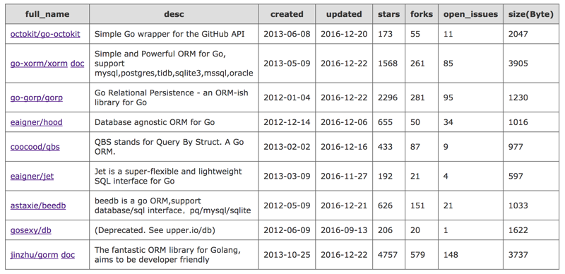

# repos_info

该程序用于对多个github上的项目进行摘要信息收集，显示信息包括点赞数、Fork数目、repos size等各种信息显示，生成的表格可以按照升降序进行排列，该程序为python程序，需要安装tornado， `pip install tornado`，程序默认启动端口为8888，然后可以使用get方式进行访问。

参考:
 
1. [Github API v3](https://developer.github.com/v3/)
2. [sortable](http://www.kryogenix.org/code/browser/sorttable/)

## 1. 运行程序

 	$ yum install python-pip
	$ sudo pip install tornado
	$ python github_repo_info.py
	

## 2. 使用
通过浏览器地址访问，例如需要对于go orm多个项目进行比较，则输入：（多个repo使用“,”分割）

	   http://127.0.0.1:8888/?repos=octokit/go-octokit,go-xorm/xorm,go-gorp/gorp,eaigner/hood,coocood/qbs,eaigner/jet,astaxie/beedb,gosexy/db,jinzhu/gorm
	   
	   
根据网络情况可能会等待几秒：可以点击表头进行相关排序。

### 3. TODO
添加编程语言和根据stars进行图片显示。
	   
	   
	   
	   
